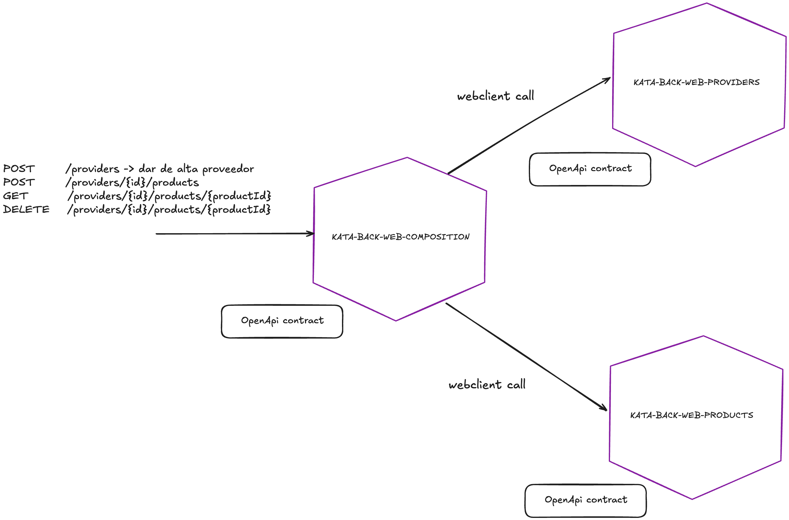

# Kata 3: Composición de Microservicios y uso de Contract-First. 🚀

## 🎯 Objetivo

Construir una solución de **tres microservicios** que trabajen en conjunto para gestionar información de **productos** y **proveedores**, utilizando **OpenAPI** para definir y generar contratos de comunicación.

Esta Kata es una evolución de la Kata 1 que vimos hace unas semanas.

## 🛠️ Descripción

Deberás crear tres microservicios independientes:

1. **Microservicio de Productos** 📦: Gestiona información sobre productos.

2. **Microservicio de Proveedores** 🧑‍💼: Gestiona información sobre proveedores.

3. **Microservicio de Composición** 🧩: Combina información de productos y proveedores, exponiendo una API consolidada.

**Nota:**
- Podéis reutilizar el desarrollo que tengáis ya hecho de la primera kata.
- Para las BBDD de kata-back-web-providers y kata-back-web-products podéis hacer una de las dos opciones siguientes:
    - Levantar una única BBDD de Postgres y compartirla entre ambos, si hacéis esto y tenéis flyway activado, tendréis que activarlo en un único microservicio.
    - Levantar dos BBDD de Postgres, una para cada microservicio. Para que funcionen okay, deberás exponerlas en puertos distintos.

---

## 📋 Requisitos

### 1. Generación de proyectos

- Crear los tres microservicios usando el arquetipo web de fwkcna: [Documentación arquetipo web](https://fwk.srv.mercadona.com/framework/spring-boot?pathname=/4.25.4/archetype/web/).

### 2. Definición y generación de contratos

- Definir las APIs utilizando **OpenAPI (Swagger)**.

- Usar el **plugin de OpenAPI Generator** en los `pom.xml` de los adaptadores para generar artefactos de:

    - **Cliente** (para consumir otros servicios)

    - **Servidor** (para exponer los endpoints)

### 3. Implementación

- Implementar cada microservicio utilizando los artefactos **generados**.

- Asegurar que cada micro:

    - Expone su API utilizando las **interfaces de servidor** generadas.

    - Consume otros micros utilizando los **clientes** generados.

---

## 📡 Endpoints que debe exponer el Microservicio de Composición

- `POST /providers` ➡️ Dar de alta un proveedor.

- `POST /providers/{id}/products` ➡️ Crear un producto para un proveedor específico.

- `GET /providers/{id}/products/{productId}` ➡️ Obtener un producto por su ID asociado a un proveedor.

- `DELETE /providers/{id}/products/{productId}` ➡️ Eliminar un producto de un proveedor.

---

## APUNTES:
### 1.- ¿Cómo generar los artefactos a partir de clientes?

Se sube un proyecto de ejemplo donde se muestra cómo generar y hacer uso de artefactos servidores y de clientes.

Los artefactos serán generados mediante el plugin `openapi-generator-maven-plugin`. En el módulo `api-rest` encontrarás un ejemplo de la configuración dentro del `pom.xml` para generar artefactos servidores, mientras que en el módulo `webclient` encontrarás la configuración para generar artefactos clientes.

Las clases `SuperMarketControllerAdapter` y `SuperMarketWebClientAdapter` hacen uso del artefacto servidor y cliente respectivamente.

En cada uno de sus módulos, bajo `src/main/resources` encontraréis los contratos openapi con los que se han generado los artefactos. El contrato de ejemplo se ha nombrado como `supermarket-openapi-v3.yml`

Los artefactos (con los POJOs Java) son generados cuando lancéis el comando `mvn clean install` sobre el proyecto. Los encontraréis bajo `target/generated-sources/openapi`.

**Nota:**
- **En vuestro día a día desarrollando aplicaciones para Mercadona, la generación de estos artefactos se realiza mediante las pipes contract-first presentes en los proyectos**. Estas pipes por debajo generan los artefactos y los publican en Artifactory para que pueden ser usados por el resto.
- Dado que para este ejercicio no disponemos de pipe de contract-first, **para simular la metodología contract-first hemos optado por la inclusión del plugin `openapi-generator-maven-plugin`. En vuestro día a día desarrollando aplicaciones para Mercadona NO será necesario incluir este plugin dentro de vuestros proyectos**, ya que la generación de los artefactos se delega enteramente en la pipe de contracto-first.

### 2.- ¿Cómo estructurar el repositorio?

Dentro del repositorio incluiréis los tres microservicios siguiendo la siguiente estructura:

- kata-back-web-composition
- kata-back-web-providers
- kata-back-web-providers
- README.md 

